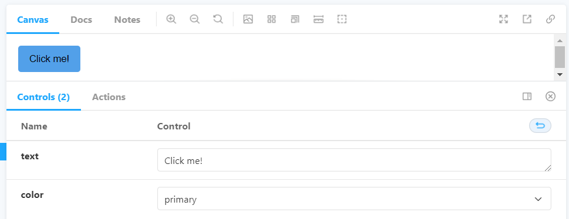
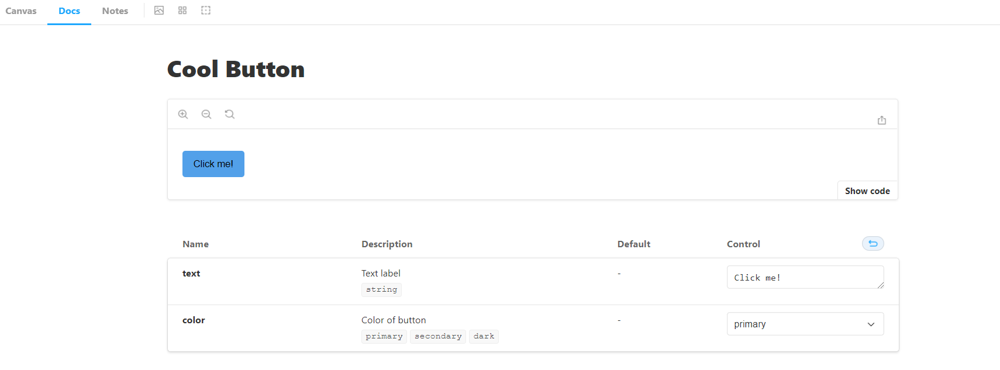
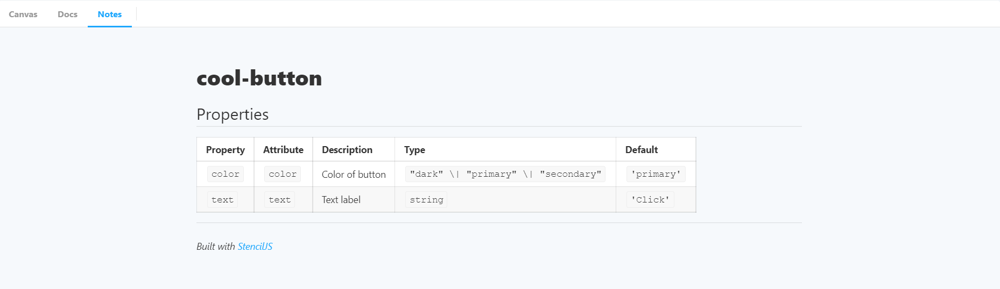

# Storybook with StencilJS

## Setup project

### Create a Stencil Project
```sh
npm init stencil
```

Answer this way
```sh
✔ Pick a starter > component
✔ Project name > storybook-wc-stencil
```

### Install dependencies
```sh
cd storybook-wc-stencil
yarn install
```

### Ignore node_modules code on check
Add _skipLibCheck_ property to exclude node_modules code

_**tsconfig.json**_
```json
{
  "compilerOptions": {
    ...
    "skipLibCheck": true,
  },
  ...
```

### Create a typing file for tsx imports

_**src/typings.d.ts**_
```ts
declare module '*.jpg';

declare module '*.md' {
  const value: string; // markdown is just a string
  export default value;
}

declare module '*.css' {
  const content: { [className: string]: string };
  export default content;
}
```

### Add storybook

```sh
npx -p @storybook/cli sb init --type html 
```


### Add notes addon

```sh
yarn add -D @storybook/addon-notes
```

_**.storybook/main.js**_
```js
module.exports = {
  stories: ['../src/**/*.stories.mdx', '../src/**/*.stories.@(js|jsx|ts|tsx)'],
  addons: [
    '@storybook/addon-links',
    '@storybook/addon-essentials',
    '@storybook/addon-notes',
  ],
  framework: '@storybook/html',
};

```

### Configuration to load Stencil components on Storybook

_**.storybook/preview.js**_
```js
import { defineCustomElements } from '../dist/esm/loader';

defineCustomElements();

export const parameters = {
  actions: { argTypesRegex: '^on[A-Z].*' },
  controls: {
    matchers: {
      color: /(background|color)$/i,
      date: /Date$/,
    },
  },
};

```

### Clean stories

Let's remove all content from stories directory

### Project structure

Create a new file called _**my-component.stories.tsx**_ inside _**src/stories**_ directory

Your project structure should look like this

```
./storybook-wc-stencil/
|
|---- .storybook/
|     |---- main.js
|     |---- preview.js
|---- src/
|     |---- components/
|     |     |---- my-component/
|     |           |---- my-component.css
|     |           |---- my-component.e2e.ts
|     |           |---- my-component.spec.ts
|     |           |---- my-component.tsx
|     |           |---- readme.md
|     |---- stories/
|           |---- components/
|                 |---- my-component.stories.tsx
|---- .editorconfig
|---- .gitignore
|---- .prettierrc.json
|---- LICENSE
|---- package.json
|---- readme.md
|---- stencil.config.ts
|---- tsconfig.json
|---- yarn.lock
```

### Generate components

We can use the next command to automatically generate our components on our _components_ directory

```sh
yarn generate component-name
```

### Run Project

For having hot reload, we must execute this two commands in parallel, so we can use two terminals
or create a new script

```sh
yarn build -- --watch
```

```sh
yarn storybook
```

### Story code structure

We are going to face some disadvantages when working storybook with stencil
- We need to define properties that we want to use in controls
  - We need to define default props for controls
- We need to add description and prop types for Docs pages
- defaultValue property is not working for Doc pages
- We need to pass args values on the template

```ts
// This md file is generated by stencil, and we are going to use it as a note page
import notes from '../../components/my-component/readme.md';

export default {
  title: 'UI/My Component',
  args: {
    // Here we define default values that we want to show on controls
    // Also, only props defined here are going to be shown
    first: 'Juan Fernando',
    middle: 'Gómez',
    last: 'Maldonado',
  },
  argTypes: {
    // Here we can add description and prop value type
    first: {
      description: 'First name',
      // First way to define type
      table: {
        type: {
          summary: 'string',
        },
      },
    },
    middle: {
      // Second and shorter way to define type
      type: {
        summary: 'string',
      },
    },
    last: {
      // We can disable the property
      // This will hide it in controls and Doc page
      table: {
        disable: true,
      },
    },
  },
  parameters: {
    // This will create a note page for our story component
    notes,
  },
};

const Template = args =>
  `<my-component first="${args.first}" middle="${args.middle}" last="${args.last}"></my-component>`;

export const Basic = Template.bind({});

export const Another = Template.bind({});
Another.args = {
  first: 'John',
};
```

### Cleaner way for adding values and description on stories

We are going to use the library [story-wc-generator](https://www.npmjs.com/package/story-wc-generator)
to generate args, argTypes and the template.

```sh
yarn add story-wc-generator
```

```ts
import notes from '../../components/cool-button/readme.md';
import storyGenerator from 'story-wc-generator';

const { args, argTypes, Template } = storyGenerator('cool-button', {
  text: { value: 'Click me!', description: 'Text label', type: 'string' },
  color: {
    value: 'primary',
    description: 'Color of button',
    control: 'select',
    options: ['primary', 'secondary', 'dark'],
    type: 'primary | secondary | dark',
  },
});

export default {
  title: 'UI/Cool Button',
  args,
  argTypes,
  parameters: {
    notes,
  },
};

export const Primary = Template.bind({});

export const Secondary = Template.bind({});
Secondary.args = {
  color: 'secondary',
};

...
```

This example includes all properties that can be used, but you can go to the
[documentation](https://www.npmjs.com/package/story-wc-generator) for more description about the library

The previous implementation will give us stories with controls and documentation
#### Canvas
</img>

#### Docs
</img>

#### Notes
Also, Stencil generates readme files for each component, so thanks to the notes addon
we can use that readme as a new page for more specifications about the component.

</img>